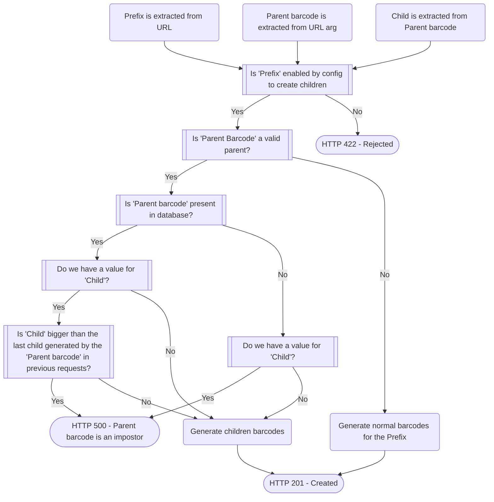

# Baracoda


[](https://github.com/psf/black)
[](https://codecov.io/gh/sanger/baracoda)

Barcode generation using postgres sequences and pre-defined prefixes.

## Features

Baracoda is a JSON-based microservice written in Python and backed in a
PostgreSQL database, with the purpose of handling the creation
of new barcodes for the LIMS application supported currently in PSD.

These are some of the key features currently supported:

* Creation of single barcodes
* Creation of group of barcodes
* Support for children barcodes creation
* Retrieval of the last barcode created for a prefix
* Support for different barcode formats

## Table of Contents

<!-- toc -->

- [Requirements for Development](#requirements-for-development)
  * [Setup Steps](#setup-steps)
- [Running](#running)
- [Configuration](#configuration)
- [Testing](#testing)
  * [Testing Requirements](#testing-requirements)
  * [Running Tests](#running-tests)
- [Formatting, Linting and Type Checking](#formatting-linting-and-type-checking)
  * [Formatting](#formatting)
  * [Linting](#linting)
  * [Type Checking](#type-checking)
- [Deployment](#deployment)
- [Autogenerating Migrations](#autogenerating-migrations)
- [Routes](#routes)
- [Miscellaneous](#miscellaneous)
  * [Troubleshooting](#troubleshooting)
    + [Installing psycopg2](#installing-psycopg2)
  * [Updating the Table of Contents](#updating-the-table-of-contents)

<!-- tocstop -->

## Requirements for Development

The following tools are required for development:

- python (use `pyenv` or something similar to install the python version specified in the `Pipfile`)
- postgresql server and `pg_config` library
  - if using homebrew (this will install both the server and library):

        brew install postgresql@9.6
        brew link postgresql@9.6 --force

    Create the development database and user using a RDBMS GUI or by running this query in a client:

        create database baracoda_dev;
        grant all privileges on database baracoda_dev to postgres;

  - to spin up a server using Docker (the `pg_config` library will still be needed by the
application), use the `docker-compose.yml` file:

        docker compose up -d

    The compose service automatically creates the `baracoda_dev` database and `postgres` user.
- Git hooks are executed using [lefthook](https://github.com/evilmartians/lefthook), install
  lefthook using homebrew and add the pre-commit and pre-push hooks as follows:

      lefthook add pre-commit
      lefthook add pre-push
- [talisman](https://github.com/thoughtworks/talisman) is used as a credentials checker, to ignore
  files which it triggers as false positives, follow the instructions in the git commit output by
  adding the files to be ignore to a `.talismanrc` file and try commit again.

### Setup Steps

1. Create and enter the virtual environment:

        pipenv shell

1. Install the required dependencies:

        pipenv install --dev

    See the [Troubleshooting](#troubleshooting) section for any commonly encountered installation issues.

1. Create the required sequences and tables:

        flask init-db

1. Run the migrations:

        alembic upgrade head

## Running

To run the service:

    flask run

## Testing

### Testing Requirements

The test suite requires a test database, currently named `baracoda_test`.

Create the database using a RDBMS GUI or by running this query in a client:

    create database baracoda_test;
    grant all privileges on database baracoda_test to postgres;

### Running Tests

To run the test suite:

    python -m pytest -vx

## Formatting, Linting and Type Checking

### Formatting

This project is formatted using [black](https://github.com/psf/black). To run formatting checks,
run:

    pipenv run black .

### Linting

This project is linted using [flake8](https://github.com/pycqa/flake8). To lint the code, run:

    pipenv run flake8

### Type Checking

This project uses static type checking provided by the [mypy](https://github.com/python/mypy)
library, to run manually:

    pipenv run mypy .

## Deployment

This project uses a Docker image as the unit of deployment. The image is created by GitHub actions.
To trigger the creation of a new image, increment the `.release-version` version with the
corresponding change according to [semver](https://semver.org/).

## Autogenerating Migrations

- Make sure your local database is up to date with last schema available
- Perform any change in the models files located in the `baracoda/orm` folder
- Run alembic and provide a comment to autogenerate the migration comparing with current database:

      alembic revision --autogenerate -m "Added account table"

## Routes

The following routes are available from this service:

    flask routes

    Endpoint                                Methods  Rule
    --------------------------------------  -------  ----------------------------
    barcode_creation.get_last_barcode       GET      /barcodes/<prefix>/last
    barcode_creation.get_new_barcode        POST     /barcodes/<prefix>/new
    barcode_creation.get_new_barcode_group  POST     /barcodes_group/<prefix>/new
    health_check                            GET      /health
    static                                  GET      /static/<path:filename>

## Miscellaneous

### Configuration

The default configuration of the currently supported prefixes is specified in the
```baracoda/config/defaults.py``` module. For example:
```json
    {
        "prefix": "HT",
        "sequence_name": "ht",
        "formatter_class": GenericBarcodeFormatter,
        "enableChildrenCreation": False,
    }
```
These are the allowed keywords that we can specify to configure a prefix:

- ```prefix```: This is the string that represents the prefix we are configuring for
supporting new barcodes.
- ```sequence_name```: This is the sequence name in the PostgreSQL database with will
keep record of the last index created for a barcode. Prefixes can share the same
sequence.
- ```formatter_class```: Defines the class that will generate the string that represents
a new barcode by using the prefix and the new value obtained from the sequence.
If we want to support a new formatter class we have to provide a class that implements
the interface ```baracoda.formats.FormatterInterface```.
- ```enableChildrenCreation```: Defines if the prefix has enabled the children creation.
If true, the prefix will support creating barcodes based on a parent barcode
If it is False, the prefix will reject any children creation request for that prefix.

### About Children barcode creation

Children barcodes from a parent barcode can be created with a POST request to the
endpoint with a JSON body:

```/child-barcodes/<PREFIX/new```

The inputs for this request will be:

- *Prefix* : prefix where we want to create the children under. This argument will be
extracted from the URL ```/child-barcodes/<PREFIX/new```
All barcodes for the children will have this prefix (example, prefix HT will generate children
like HT-11111-1, HT-11111-2, etc)
- *Parent Barcode* : barcode that will act as parent of the children. This argument will be
extracted from the Body of the request, eg: ```{'barcode': 'HT-1-1', 'count': 2}```.
To be considered valid, the barcode needs to follow the format <PREFIX>-<NUMBER>(-<NUMBER>)?
where the last number part is optional (it represents if the barcode was a child).
For example, valid barcodes would be ```HT-11111-13``` (normal parent) and ```HT-11112-24```
(parent that was a child) but not ```HT-1-1-1``` or ```HT12341-1```.
- *Child* : part of the Parent barcode string that would identify if the parent was
a child before (the last number). For example for the *Parent barcode* ```HT-11111-14```,
*Child* would be 14; but for the *Parent barcode* ```HT-11111```, *Child* would have no
value defined.
- *Count* : number of children barcodes to create.

There is the possibility that the parent barcode received is in the wrong format, in
which case this endpoint will generate a normal barcode.
There is the possibility that the parent barcode receied has a children barcode format
that is logically incorrect from database perspective, in that case the request
will be rejected as 'Impostor' barcode.

The following diagram describes the workflow of how this endpoint will behave depending on
the inputs declared before:




### Troubleshooting

#### Installing psycopg2

If errors are experienced while pipenv attempts to install `psycopg2`, try this:

    LDFLAGS=`echo $(pg_config --ldflags)` pipenv install --dev

You can also try installing `psycopg2` from the binary, which avoids the need for `pg_config` locally.
To install `psycopg2` as a binary, change the `psycopg2` entry in the Pipfile to say `psycopg2-binary` instead, and then run:

    pipenv install psycopg2-binary

You can then run `pipenv install --dev` again to get all the other dependencies installed.
This approach should allow you to install the postgres python driver (psycopg2) locally, without having a local copy of postgres. Use docker to run postgres as described in the 'Requirements for Development' section.
Don't commit your changes to the Pipfile or Pipfile.lock.

### Updating the Table of Contents

To update the table of contents after adding things to this README you can use the [markdown-toc](https://github.com/jonschlinkert/markdown-toc)
node module. To run:

    npx markdown-toc -i README.md
